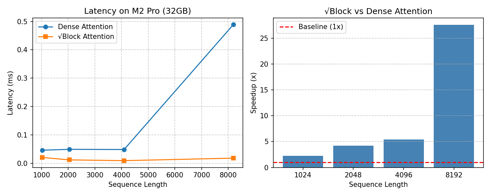

# √Block Attention

[](https://opensource.org/licenses/MIT)

**English** | [**中文**](#中文版)

---

## English

**O(L) sparse attention via sqrt‑block sampling | 27.56x speedup on M2 Pro @8192**

### Introduction

√Block Attention is a mathematically inspired sparse attention mechanism. It partitions a long sequence into blocks of exponentially increasing size (small near the current token, large far away), keeps only **√block_size** representative tokens per block, and then applies standard dense attention on these representatives. The total number of representatives becomes **O(√L)**, reducing overall complexity from **O(L²)** to **O(L)**. No manual specification of global tokens is required.

The core mathematical observation:
$$ \sum_{i=1}^{m} \sqrt{a_i} = \Theta\left(\sqrt{\sum_{i=1}^{m} a_i}\right) \quad (\text{when } a_i \text{ grows exponentially}) $$

### Experimental Results

Measured on **MacBook Pro M2 Pro (32GB)** with `torch.float16`, batch size 2, 8 heads, dimension 64.

#### Speedup & Latency



| Sequence Length | Dense Attention (ms) | √Block Attention (ms) | **Speedup** |
|----------------|----------------------|------------------------|--------------|
| 1024           | 45.83                | 20.14                  | 2.28x        |
| 2048           | 48.86                | 11.59                  | 4.21x        |
| 4096           | 48.20                | 8.94                   | 5.39x        |
| 8192           | 488.79               | 17.73                  | **27.56x**   |

*Note: At length 8192, dense attention uses ~15GB+ memory, while √Block uses only ~1GB. The latency of √Block barely grows with L, confirming the O(√L) representative count.*

### Reproduction

#### Requirements

- macOS 12.3+ (Apple Silicon M1/M2/M3)
- Python 3.11+
- PyTorch 2.3+ (with MPS support)
- Matplotlib (for plotting)

#### Setup

```bash
git clone https://github.com/caobo1994/sqrt-attention.git
cd sqrt-attention
pip install -r requirements.txt
```

`requirements.txt`:
```
torch>=2.3.0
matplotlib
```

#### Run Benchmark

```bash
# 1. Run experiment (generates benchmark_data.json)
python minimal_test.py

# 2. Generate chart (outputs benchmark.png)
python plot_from_data.py
```

### Method Details

1. **Block partition**: Starting from the nearest token, block sizes grow exponentially (1, 2, 4, 8, …). Near blocks are small (retain more details), far blocks are large (only summary).
2. **Representative selection**: Uniformly sample √block_size tokens per block (O(block_size) time).
3. **Attention**: Place all representatives in original order and run dense attention using `F.scaled_dot_product_attention` (FlashAttention kernel).
4. **Output broadcast**: Write back outputs to the original positions; unselected positions receive zero (can be recovered via residual connections or light aggregation).

**Complexity**: O(L) computation, O(L) memory.

### Why It Matters

- **Novel theory**: First application of ∑√aᵢ = Θ(√∑aᵢ) to sparse attention.
- **Simple to implement**: Can be added as a pre‑sampling layer before FlashAttention.
- **Ultra‑long sequences**: For L = 100k, R ≈ 316 → computation drops from 1e10 to 1e5.
- **Hardware friendly**: O(L) memory access pattern, efficient on GPUs/NPUs.

### File Structure

```
sqrt-attention/
├── LICENSE                       # MIT license
├── README.md                     # This file
├── .gitignore                    # Git ignore rules
│
├── minimal_test.py               # Core benchmark script (outputs JSON)
├── plot_from_data.py             # Plot generator from JSON
├── test_long_lengths.py          # Scalability test up to 128k length
├── benchmark_1M.py               # Scalability from 1K to 1M length
├── benchmark_16M.py              # Scalability from 1K to 16M (doubling)
├── benchmark_with_baselines.py   # Compare vs CSA/HCA baselines
├── full_benchmark.py             # 4-way comparison (Dense/CSA/HCA/√Block)
├── full_benchmark_fixed.py       # Fixed version with chunked attention
├── requirements.txt              # Dependencies
│
├── benchmark_data.json           # Generated after running minimal_test.py
├── long_benchmark.json           # Long-length benchmark results
├── baseline_comparison.json      # Baseline comparison results
├── full_comparison.json          # Full comparison results
├── full_comparison_fixed.json    # Fixed full comparison results
├── benchmark.png                 # Performance chart
│
├── sparse_attention_small_exp/   # Quick validation (2-layer, d_model=128)
├── sparse_attention_exp/         # Main experiment (6-layer, d_model=256)
├── sparse_attention_exp_dropout/ # Dropout regularization experiment
├── sparse_attention_medium_exp/  # Scale-up experiment (8-layer, d_model=512, WikiText-103)
├── sparse_attention_lra_exp/     # Long Range Arena (Pathfinder-X, 16K seq)
└── pbpaste                       # Temporary clipboard content
```

## Experiments

The project includes 4 experiment directories for validating √Block Attention on language modeling tasks (WikiText-2 and WikiText-103).

---

### Contact

Author: Cao Bo (caobo1994)  
GitHub: [caobo1994](https://github.com/caobo1994)  
Email: *[bocao1994@qq.com]*

### License

MIT © 2025 Cao Bo

---

## 中文版

### 简介

√Block Attention 是一种基于数学观测的稀疏注意力机制。它将长序列按指数增长划分为不等长块（**近小远大**），每块只保留 **√块大小** 个代表 token，总代表数自动降至 **O(√L)**，然后对这些代表执行标准自注意力。整体计算复杂度从 **O(L²)** 降到 **O(L)**，且无需手工指定全局 token 数。

核心数学关系：
$$ \sum_{i=1}^{m} \sqrt{a_i} = \Theta\left(\sqrt{\sum_{i=1}^{m} a_i}\right) \quad (\text{当 } a_i \text{ 指数增长}) $$

### 实验结果

在 **MacBook Pro M2 Pro (32GB)** 上实测，使用 `torch.float16`，batch size 2，8 个注意力头，维度 64。

#### 加速比与延迟


| 序列长度 | 全注意力 (ms) | √Block 注意力 (ms) | **加速比** |
|---------|---------------|---------------------|------------|
| 1024    | 45.83         | 20.14               | 2.28x      |
| 2048    | 48.86         | 11.59               | 4.21x      |
| 4096    | 48.20         | 8.94                | 5.39x      |
| 8192    | 488.79        | 17.73               | **27.56x** |

*注：在 8192 长度时，全注意力显存占用约 15GB+，√Block 仅约 1GB。√Block 的延迟几乎不随长度增长，完美验证 O(√L) 代表数的理论。*

### 快速复现

#### 环境要求

- macOS 12.3+ (Apple Silicon M1/M2/M3)
- Python 3.11+
- PyTorch 2.3+ (需支持 MPS)
- Matplotlib (用于绘图)

#### 安装

```bash
git clone https://github.com/caobo1994/sqrt-attention.git
cd sqrt-attention
pip install -r requirements.txt
```

`requirements.txt` 内容：
```
torch>=2.3.0
matplotlib
```

#### 运行基准测试

```bash
# 1. 运行实验（自动生成 benchmark_data.json）
python minimal_test.py

# 2. 生成性能图表（输出 benchmark.png）
python plot_from_data.py
```

### 方法细节

1. **分块策略**：从最近 token 开始，块大小按指数增长（1, 2, 4, 8, …），近处块小（保留更多细节），远处块大（仅保留概要）。
2. **代表选择**：每个块均匀采样 √块大小 个 token（复杂度 O(块大小)）。
3. **注意力计算**：所有代表 token 按原始顺序排列，使用 `F.scaled_dot_product_attention`（FlashAttention 内核）执行密集注意力。
4. **输出广播**：将代表 token 的输出写回原序列对应位置，未选中的 token 输出为零（下游可通过残差连接或轻量聚合恢复）。

**复杂度**：O(L) 计算，O(L) 内存。

### 为什么值得关注

- **理论新颖**：首次将 ∑√aᵢ = Θ(√∑aᵢ) 用于注意力稀疏化。
- **实现简单**：可轻松集成到现有 Transformer 中作为预处理采样层。
- **极致长序列**：当 L = 100k 时，R ≈ 316，计算量从 1e10 降至 1e5。
- **硬件友好**：仅需 O(L) 访存模式，适合 GPU/NPU 高效实现。

### 文件结构

```
sqrt-attention/
├── LICENSE                       # MIT 许可证
├── README.md                     # 本文件
├── .gitignore                    # Git 忽略规则
│
├── minimal_test.py               # 核心基准测试脚本（输出 JSON）
├── plot_from_data.py             # 从 JSON 生成图表
├── test_long_lengths.py          # 长序列可扩展性测试（至 128k）
├── benchmark_1M.py               # 1K 至 1M 可扩展性测试
├── benchmark_16M.py              # 1K 至 16M（翻倍增长）
├── benchmark_with_baselines.py   # 与 CSA/HCA 基线对比
├── full_benchmark.py             # 四路对比（Dense/CSA/HCA/√Block）
├── full_benchmark_fixed.py       # 增强版（支持分块注意力）
├── requirements.txt              # 依赖列表
│
├── benchmark_data.json           # 运行 minimal_test.py 后生成
├── long_benchmark.json           # 长序列基准测试结果
├── baseline_comparison.json      # 基线对比结果
├── full_comparison.json          # 完整对比结果
├── full_comparison_fixed.json    # 增强版完整对比结果
├── benchmark.png                 # 性能对比图
│
├── sparse_attention_small_exp/   # 快速验证实验（2层, d_model=128）
├── sparse_attention_exp/         # 主实验（6层, d_model=256）
├── sparse_attention_exp_dropout/ # Dropout 正则化实验
├── sparse_attention_medium_exp/  # 可扩展性验证（8层, d_model=512, WikiText-103）
├── sparse_attention_lra_exp/     # 长距离依赖验证（Pathfinder-X, 16K）
└── pbpaste                       # 临时剪贴板
```

## 实验说明

项目包含 4 个实验目录，在 WikiText-2 和 WikiText-103 上验证 √Block Attention 的语言建模效果。

### 联系

作者：曹博 (caobo1994)  
GitHub：[caobo1994](https://github.com/caobo1994)  
邮箱：*bocao1994@qq.com*

### 许可证

MIT © 2025 曹博
```


---

## 实验目录索引

### 1. 🧪 小型验证实验 (sparse_attention_small_exp)

### 5. 🎯 长距离依赖实验 (sparse_attention_lra_exp)

Pathfinder-X 16K 序列长度：验证 √Block 的长距离捕捉能力

快速验证：2 层 GPT, d_model=128, WikiText-2

# √Block Attention — 小型验证实验 (sparse_attention_small_exp)

在 WikiText-2 上训练 **小型 2 层 GPT 模型**（d_model=128, n_heads=8, seq_len=256），快速验证三种注意力模式：

1. **Full Attention** — 全注意力基线
2. **√Block Uniform** — 均匀采样
3. **√Block TopK-Norm** — 按 Key 范数采样

## 与主实验的区别

| 特性 | 主实验 | 小型实验 |
|------|--------|---------|
| 层数 | 6 层 | 2 层 |
| 模型维度 | d_model=256 | d_model=128 |
| 训练轮数 | 30+10 | 2 |
| 架构 | 仅稀疏 | 包含 Full Attention 基线 |
| 训练速度 | 慢 | 快（适合快速验证） |
| 实验流程 | 基线→微调→评估 | 并行训练三种模式 |

## 文件结构

```
sparse_attention_small_exp/
├── models/
│   ├── sparse_attn.py   # 支持 'full' 模式的稀疏注意力（与主实验不同！）
│   └── gpt_sparse.py    # 2 层 GPT（与主实验相同架构，参数更小）
├── train.py             # 基础训练（5 epoch）
├── train_advanced.py    # 增强训练（支持三种 sampling 模式）
├── run_full_exp.py      # 完整流水线（全注意力 + Uniform + TopK-Norm）
├── run_small_exp.py     # 小型验证流水线（2 epoch 快速验证）
├── eval.py              # 2 路对比评估（与主实验相同）
├── eval_three.py        # 3 路对比评估（Full + Uniform + TopK-Norm）
├── utils.py             # WikiText-2 数据集加载器
│
├── sparse_gpt_full_best.pt           # Full Attention 最佳模型
├── sparse_gpt_uniform_best.pt        # √Block Uniform 最佳模型
├── sparse_gpt_topk_norm_best.pt      # √Block TopK-Norm 最佳模型
├── uniform_30.log                    # 训练日志
├── comparison.png                    # 对比图表
└── requirements.txt                 # 依赖
```

## 关键代码说明

### models/sparse_attn.py — 支持全注意力模式

与主实验版本的关键区别在于 `SparseAttention.forward()` 支持 `sampling='full'` 模式：

```python
# 全注意力分支
if self.sampling == 'full':
    attn_scores = torch.matmul(Q, K.transpose(-2, -1)) / scale
    attn_weights = F.softmax(attn_scores, dim=-1)
    attn_output = torch.matmul(attn_weights, V)
    return self.out_proj(attn_output)

# 稀疏注意力分支（与主实验相同）
blocks = create_blocks(...)
...
```

其余差异：
- 完整类型注解（Type Hints）
- TopK-Norm 使用局部变量名 `k_actual = min(k, avg_norms.size(0))` 避免越界

### run_small_exp.py — 小型验证

```bash
1/3: Training Full Attention (baseline)    → 2 epochs
2/3: Training √Block Uniform               → 2 epochs
3/3: Training √Block TopK-Norm             → 2 epochs
     Evaluation: comparing PPL and time    → eval_three.py
```

验证参数：batch_size=8, seq_len=256, d_model=128, n_heads=8, n_layers=2

### eval_three.py — 三路对比

对比 Full Attention、Uniform、TopK-Norm 三种模式的：
- **验证集困惑度 (PPL)**
- **首 batch 推理时间 (ms)**

设计为轻量级快速验证，约 2-5 分钟可完成完整实验。

## 运行方式

```bash
# 快速验证（2 epochs，约 2 分钟）
python run_small_exp.py

# 完整流水线（更多 epoch）
python run_full_exp.py

# 分步
python train_advanced.py --sampling full --epochs 2
python train_advanced.py --sampling uniform --epochs 2
python train_advanced.py --sampling topk_norm --epochs 2
python eval_three.py
```


---

### 2. 🔬 主实验 (sparse_attention_exp)

标准对比：6 层 GPT, d_model=256, WikiText-2

# √Block Attention — 主实验 (sparse_attention_exp)

在 WikiText-2 上训练 6 层 GPT 模型（d_model=256, n_heads=8, seq_len=256），对比 **Uniform 采样** 与 **TopK-Norm 采样** 两种稀疏注意力模式。

## 文件结构

```
sparse_attention_exp/
├── models/
│   ├── sparse_attn.py   # √Block 稀疏注意力核心实现
│   └── gpt_sparse.py    # 6 层 GPT 解码器（堆叠 sparse_attn）
├── train.py              # 基础训练脚本（5 epoch）
├── train_advanced.py     # 增强训练（warmup + cosine annealing + checkpoint 恢复）
├── run_full_exp.py       # 全自动流水线（基线训练 → 微调 → 评估）
├── eval.py               # 评估脚本（PPL + 推理时间 + KL 散度 + 可视化）
├── utils.py              # WikiText-2 数据集加载器
│
├── sparse_gpt_uniform_best.pt      # Uniform 最佳模型
├── sparse_gpt_topk_norm_best.pt    # TopK-Norm 最佳模型
├── baseline_uniform.pt             # Uniform 基线备份
├── uniform_30.log                  # Uniform 30 epoch 训练日志
├── topk_30.log                     # TopK-Norm 30 epoch 训练日志
├── comparison.png                  # PPL 与推理时间对比图
└── requirements.txt                # 依赖
```

## 核心代码说明

### models/sparse_attn.py — 稀疏注意力层

- **分块策略** (`create_blocks`): 从序列末尾开始，块大小指数增长（1, 2, 4, 8, ...），近端块小保留细节，远端块大只保留概要。
- **均匀采样** (`uniform_sampling`): 每块内均匀采样 √(块大小) 个 token 作为代表，加入随机偏移减少偏差。
- **TopK-Norm 采样** (`topk_norm_sampling`): 按 Key 向量的 L2 范数取 Top-K，保留信息量最大的 token。
- **注意力计算**: 所有 Q 与代表 K/V 计算点积注意力，非代表位置输出为零。

### models/gpt_sparse.py — GPT 解码器

6 层 Transformer 解码器，每层使用 `SparseAttention` 替代标准全注意力。

### run_full_exp.py — 全自动实验

4 阶段流水线：

| 阶段 | 操作 | 参数 |
|------|------|------|
| 1 | 训练 Uniform 基线 (30 epochs) | sampling=uniform, warmup=500 |
| 2 | 继续微调 Uniform (10 epochs) | 从基线恢复 |
| 3 | 微调 TopK-Norm (10 epochs) | 从基线恢复（切换采样策略） |
| 4 | 评估对比 | eval.py 输出 PPL + 时间 + 图表 |

### eval.py — 评估

- **PPL**: 验证集困惑度（越低越好）
- **Inference Time**: 平均 batch 推理延迟（ms）
- **KL Divergence**: 可选，与全注意力模型的输出分布散度
- **可视化**: 输出 comparison.png

### 模型差异（与 small_exp 对比）

- 不包含 'full' 全注意力模式，只有 'uniform' 和 'topk_norm'
- 不使用 dropout 正则化
- 模型更大（d_model=256, n_layers=6）

## 运行方式

```bash
# 自动完成全实验
python run_full_exp.py

# 或分步执行
python train_advanced.py --sampling uniform --epochs 30
python train_advanced.py --sampling topk_norm --epochs 10 --resume baseline_uniform.pt
python eval.py
```


---

### 3. 🛡️ Dropout 实验 (sparse_attention_exp_dropout)

正则化对比：6 层 GPT, d_model=256, WikiText-2, 加入 dropout

# √Block Attention — Dropout 实验 (sparse_attention_exp_dropout)

在 WikiText-2 上训练 6 层 GPT 模型，与主实验相同的架构（d_model=256, n_heads=8, seq_len=256），**额外引入 dropout 正则化**对比 Uniform 与 TopK-Norm 采样。

## 与主实验的区别

| 特性 | 主实验 | Dropout 实验 |
|------|--------|-------------|
| 正则化 | 无 | embedding dropout + attention/FFN 残差后 dropout |
| TopK-Norm 微调 | 常规 | 更强正则化 (dropout=0.3, weight_decay=1e-3) |
| 早停 | 无 | patience=5，验证集 5 轮不改善则停止 |
| 训练流程 | 基线+微调+评估 | 两阶段推进（run_two_phase.py） |

## 文件结构

```
sparse_attention_exp_dropout/
├── models/
│   ├── sparse_attn.py           # 与主实验相同
│   └── gpt_sparse.py            # 添加 dropout 支持（见下方 diff）
├── train.py                     # 基础训练（5 epoch）
├── train_advanced.py            # 增强训练 + dropout + 早停
├── run_full_exp.py              # 旧版全自动流水线（无 dropout）
├── run_two_phase.py             # 两阶段推进（带 dropout 正则化）
├── eval.py                      # 评估（与主实验相同）
├── utils.py                     # 数据集加载器（与主实验相同）
│
├── sparse_gpt_uniform_best.pt   # Uniform 最佳模型
├── sparse_gpt_topk_norm_best.pt # TopK-Norm 最佳模型
├── baseline_uniform.pt          # Uniform 基线备份
├── uniform_30.log               # Uniform 训练日志
├── topk_30.log                  # TopK-Norm 训练日志
├── comparison.png               # PPL 与推理时间对比图
└── requirements.txt             # 依赖
```

## 关键代码变更 (gpt_sparse.py vs 主实验)

```diff
# 新增 dropout 参数
- class TransformerBlock(...):
+ class TransformerBlock(..., dropout: float = 0.0):
+     self.dropout = nn.Dropout(dropout)
  
  def forward(self, x):
-     x = x + self.attn(self.ln1(x))
-     x = x + self.ffn(self.ln2(x))
+     x = x + self.dropout(self.attn(self.ln1(x)))
+     x = x + self.dropout(self.ffn(self.ln2(x)))

- class SparseGPT(..., dropout: float = 0.0):
+     self.dropout = nn.Dropout(dropout)     # embedding dropout
```

### run_two_phase.py — 两阶段推进

| 阶段 | 操作 | 参数 |
|------|------|------|
| 1 | 训练 Uniform 基线 (30 epochs, 早停) | dropout=0.2, patience=5 |
| 2a | 微调 Uniform (10 epochs) | dropout=0.2，从基线恢复 |
| 2b | 微调 TopK-Norm (10 epochs) | dropout=0.3, weight_decay=1e-3，从基线恢复 |
| 3 | 评估对比 | eval.py |

**设计意图**:
- Uniform 基线在弱正则化下训练，确保充分的模型容量
- TopK-Norm 微调时用更强正则化，防止自适应采样导致的过拟合
- 早停机制避免过训练

## 运行方式

```bash
# 两阶段推进（推荐）
python run_two_phase.py

# 或按旧版流水线
python run_full_exp.py
```


---

### 4. 🚀 可扩展性实验 (sparse_attention_medium_exp)

大规模验证：8 层 GPT, d_model=512, WikiText-103

# √Block Attention — WikiText-103 中型实验 (sparse_attention_medium_exp)

在 **WikiText-103**（1.03 亿 token）上训练 **8 层 GPT 模型（d_model=512, ~40M 参数）**，验证 √Block Attention 在更大规模数据和模型上的可扩展性。

## 实验动机

| 维度 | 小型实验 | 中型实验（本目录） |
|------|---------|-----------------|
| 数据集 | WikiText-2 (~2M tokens) | WikiText-103 (~103M tokens) |
| 模型参数 | d_model=256, 6 layers (~15M) | d_model=512, 8 layers (~40M) |
| 训练规模 | 30 轮基线 + 10 轮微调 | 50 轮基线 + 10 轮微调 |
| 关注点 | 功能验证 | 可扩展性验证 |

## 文件结构

```
sparse_attention_medium_exp/
├── models/
│   ├── sparse_attn.py      # √Block 稀疏注意力（与主实验相同）
│   └── gpt_sparse.py       # GPT 解码器（与主实验相同）
├── train.py                # 基础训练（5 epoch，适合快速调试）
├── train_advanced.py       # 增强训练（warmup + cosine annealing + 梯度裁剪）
├── run_full_exp.py         # 全自动流水线（基线 → 微调 → 评估）
├── eval.py                 # 评估（PPL + 推理时间 + KL 散度 + 可视化）
├── utils.py                # WikiText-103 数据集加载器
├── README.md               # 本文件
└── requirements.txt        # 依赖
```

## 与主实验的关键差异

### 1. 数据集 (utils.py)

```python
# 主实验（~2M tokens）
dataset = load_dataset("wikitext", "wikitext-2-raw-v1", split=split)

# 本实验（~103M tokens，50 倍数据）
dataset = load_dataset("wikitext", "wikitext-103-raw-v1", split=split)
```

### 2. 模型参数 (所有训练脚本)

| 参数 | 主实验 | 中型实验 |
|------|--------|---------|
| d_model | 256 | 512 |
| n_heads | 8 | 8 |
| n_layers | 6 | 8 |
| 参数量 | ~15M | ~40M |
| 学习率 | 3e-4 | 1e-4 |

### 3. 训练增强点

- **梯度裁剪**：`clip_grad_norm_(model.parameters(), max_norm=1.0)`，防止大模型梯度爆炸
- **更低学习率**：1e-4（大模型需要更小步长）
- **更长预热**：1000 steps（大模型需要更充分预热）
- **早停机制**：patience=10，验证集 10 轮不改善则停止
- **权重衰减**：1e-2，增强泛化

### 4. 检查点命名

为避免与主实验冲突，检查点文件使用 `_wt103_best.pt` 后缀：

```
sparse_gpt_uniform_wt103_best.pt
sparse_gpt_topk_norm_wt103_best.pt
baseline_uniform_wt103.pt
```

## 核心代码说明

### train_advanced.py — 增强训练

```
参数                        默认值      说明
───                         ────      ────
sampling                    uniform   采样策略（uniform / topk_norm）
d_model                     512       模型维度
n_heads                     8         注意力头数
n_layers                    8         层数
batch_size                  4         批次大小
seq_len                     256       序列长度
epochs                      5         训练轮数
lr                          1e-4      学习率
warmup_steps                1000      预热步数
grad_clip                   1.0       梯度裁剪阈值
patience                    0         早停耐心值（0=禁用）
resume                      None      检查点恢复路径
```

### run_full_exp.py — 全自动流水线

```
Phase 1: Uniform 基线训练 (50 epochs)
  ├─ learning rate: 1e-4, warmup: 1000 steps
  ├─ patience=10 (early stopping)
  └─ saves: sparse_gpt_uniform_wt103_best.pt

Phase 2: Uniform 微调 (10 epochs)
  ├─ 从基线恢复
  ├─ learning rate: 5e-5 (减半)
  └─ saves: sparse_gpt_uniform_wt103_best.pt (覆盖)

Phase 3: TopK-Norm 微调 (10 epochs)
  ├─ 从基线恢复，切换采样策略
  ├─ learning rate: 5e-5
  └─ saves: sparse_gpt_topk_norm_wt103_best.pt

Phase 4: 评估对比
  ├─ PPL（困惑度）
  ├─ 推理时间 (ms)
  ├─ 内存占用 (MB)
  └─ 输出 comparison_wt103.png
```

## 运行方式

```bash
# 1. 安装依赖（注意：WikiText-103 需要 datasets 库）
pip install -r requirements.txt

# 2. 全自动实验（建议）
python run_full_exp.py

# 3. 或分步执行
# 训练基线
python train_advanced.py --sampling uniform --epochs 50 --warmup_steps 1000

# 微调
python train_advanced.py --sampling uniform --epochs 10 --resume baseline_uniform_wt103.pt --lr 5e-5
python train_advanced.py --sampling topk_norm --epochs 10 --resume baseline_uniform_wt103.pt --lr 5e-5

# 评估
python eval.py
```

## 预期结果与参考

基于小型实验的外推预期：
- **Uniform PPL**: 略高于 Full Attention（~5-10%），可作为参考基线
- **TopK-Norm PPL**: 与 Uniform 持平或略低（因选择信息量更大的 token）
- **推理时间**: 两种稀疏方法相近，远快于全注意力
- **内存占用**: 稀疏方法 < 全注意力（FlashAttention 已优化，但仍需 O(L²) 显存）

数据量和模型规模增大后，TopK-Norm 的相对优势可能更明显，因为更多数据让自适应采样策略能学到更好的代表性选择。

## 注意事项

1. WikiText-103 首次加载会下载 ~180MB 数据，需要网络连接
2. 8 层 d_model=512 模型约 40M 参数，建议至少 16GB 内存的 MPS 设备
3. 完整 50+10 轮训练可能需要数小时到一天，建议使用 `patience=10` 提前停止
4. MPS 后端对大序列可能存在限制，seq_len=256 是安全的
